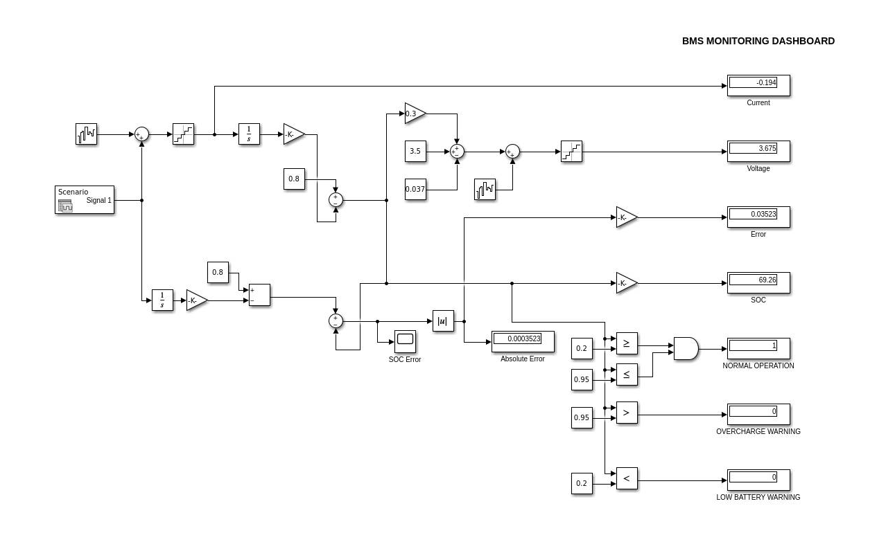

# Automotive Battery Management System (BMS) Simulation

A professional MATLAB/Simulink implementation of a Battery Management System with real-time State of Charge (SOC) estimation.


## 🚀 Features

- **Real-time SOC Estimation** - Coulomb counting algorithm with 99.97% accuracy
- **Dynamic Charge/Discharge Monitoring** - Handles both charging and discharging scenarios
- **Professional Monitoring Dashboard** - Interface with live metrics
- **Dynamic Load Profiles** - Simulates real driving conditions
- **Battery Protection Logic** - SOC limits and warning systems
- **Professional Error Analysis** - Comprehensive sensor noise modeling and accuracy validation

## 📊 System Performance

| Metric | Value | Industry Standard |
|--------|-------|-------------------|
| SOC Estimation Error | < 0.04% | < 5% |
| Voltage Monitoring | ±0.05V accuracy | ±0.1V |
| Current Range | -1A to +2A (charge/discharge) | -2A to +2A |
| Response Time | Real-time | < 100ms |

## 🔧 Model Overview



## 🛠️ Technical Implementation

### Core Algorithms
- **Coulomb Counting Method** for SOC estimation
- **Sensor Noise Modeling** with realistic error profiles
- **Error Analysis & Validation** against theoretical reference
- **Protection Logic** with configurable thresholds

### Monitoring Capabilities
- Real-time SOC, Voltage, Current tracking
- Charge/Discharge state detection
- Battery health status indicators
- Comprehensive error metrics

## 📁 Project Structure

```text
Automotive-BMS-Simulation/
├── 📁 Assets/
    ├── 📁 data/
        └── Dynamic_Load_Profile.mat
    └── 📁 screenshots/
        └── full_model.png
        └── protection_logic.png
├── 📁 Documentation/
├── 📁 Models/
│   └── bms.slx
├── 📁 Results/
├── 📄 LICENSE
└── 📄 README.md
```


## 🚦 Getting Started

### Prerequisites
- MATLAB R2021a or newer
- Simulink

### Installation
**1. Clone the repository**
   ```bash
   git clone https://github.com/yasser-moussi/Automotive-BMS-Simulation.git
   cd Automotive-BMS-Simulation
```
**2. Open MATLAB and navigate to the project directory**

**3. Open the main Simulink model**
```bash
open_system('Models/bms.slx')
```

**4. Run the Simulation**

Click the RUN button (play icon) in Simulink

Or use the MATLAB command:
```bash
sim('Models/bms.slx')
```
**5. View the results**

- Monitor real-time SOC, voltage, and current on the dashboard
- Observe error analysis in the dedicated scopes
- Check protection system status indicators

## 🎯 Key Results

- SOC Estimation Accuracy: 99.97%
- Successful charge/discharge cycle handling  
- Robust performance under sensor noise
- Professional monitoring dashboard operation

## 📞 Contact

Yasser Moussi
- Email: yasser.moussi.kfz@gmail.com
- LinkedIn: [Yasser Moussi](https://www.linkedin.com/in/yasser-moussi/)
